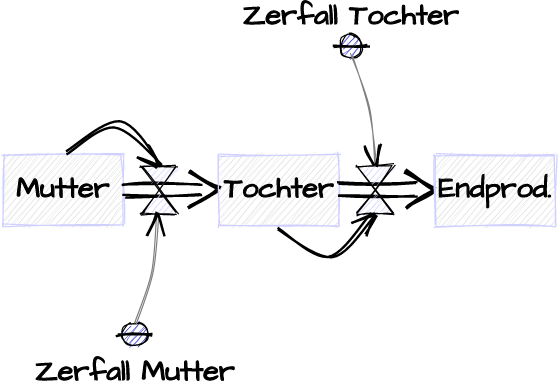
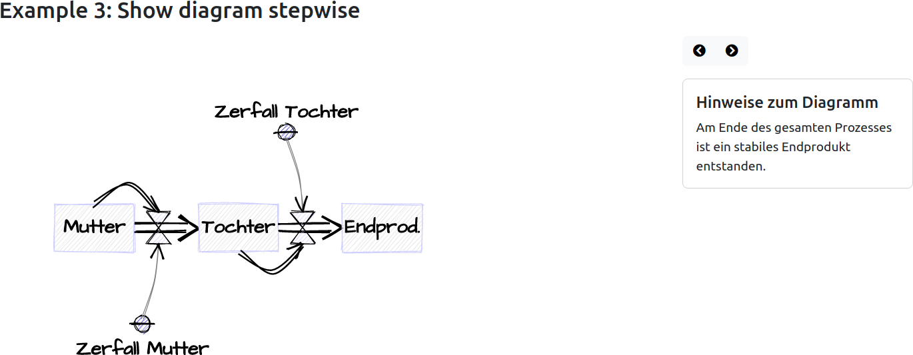
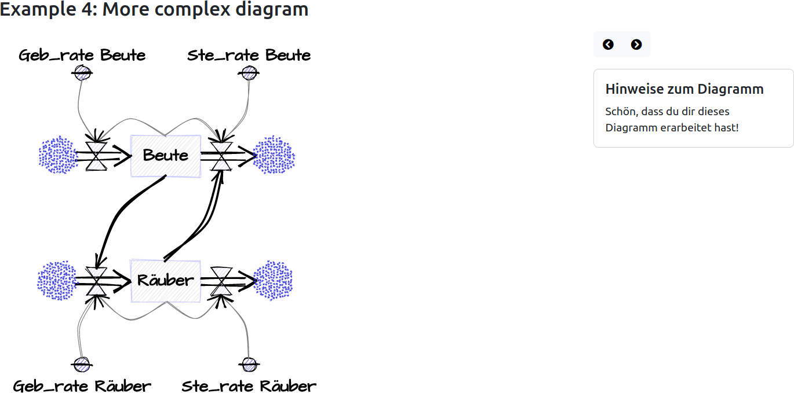

# System Dynamic Diagrams with roughjs

rough_sysdyn_diagramm

You can draw System Dynamics diagrams in rough mode. 

# Use

rough_sysdyn_diagram can be used in three modes:

* Show the diagram immediatly
* Show the diagram as a film (with delay between each "frame")
* Show the System Dynamic diagram stepwise (forward and backward) by clicking a button 

If you choose option 2 or three you can show additional informations for your audience.

## Example 1: Show diagram immediatly

First you have to declare a drawing area and name it in this case *svg_123*:

    

        

            <svg id="svg_123" width="800px" height="600px" viewbox="0 0 800 600"></svg>
        

    

Here you see the script:

    

First you create a new instance of the *RoughSd*-class with the id of your canvas (svg_123). 

    var svg_123_model = new RoughSd("svg_123")

Next you define your model as a list of objects:

Level objects use the following structure:
    
    [ 'Level', title, x, y, in-rate, out-rate, in-cloud, out-cloud]

With x and y you define the center of your symbol.

Consts objects have an easier structure:

    [ 'Const', title, x, y, position]

The position of your title can be LEFT, RIGHT, TOP or BOTTOM.

If you want to show dependencies with a link, you must declare the from- and the to-object and the bend of your link:

    [title of the from-object, title of the to-object, bend, strength]

With *.top* or *.bottom* you declare the starting or ending point of your link:

    'Zerfall Mutter.top'

If you want to connect the Rates you use *in-rate* or *out-rate*:

    'Mutter.out_rate.bottom'

After closing your model list, you call 

    svg_123_model.create_sd_model(model)
    

## Example 2: Show diagram as a film

This example hast mostly the same structure as example 1. The drawing area in this case is svg_123b, so the name
of your RoughSd-class is called *svg_123b_model*.

The model is the same. To get a delay, you insert the number of seconds:

        model = [
           ["Level", "Mutter", 120, 240, false, true, false, false, 
                "Wir beginnen unsere Betrachtung mit einer radioaktiven Ausgangssubstanz, der sogenannten 'Mutter'-Substanz"], 2,
           ["Const", "Zerfall Mutter", 180, 360, BOTTOM, 
                "Die Zerfallskonstante der Mutter bestimmt, wie schnell dieser Zerfall stattfindet."], 2,
           ["Zerfall Mutter.top", "Mutter.out_rate.bottom", -5, 1, 
                "Die Abnahme des Materials wird mit einem stilisierten Ventil dargestellt."], 2,
           ["Mutter.top", "Mutter.out_rate.top", 30, 2, 
                "Gibt es noch viel von der Ausgangsmenge, dann kann auch viel Material zerfallen."], 2,
           ["Level", "Tochter", 300, 240, false, true, false, false, 
                "Die beim Zerfall der Mutter-Substant entstehende Substanz ist ebenfalls radioaktiv. Diese Substanz nennen wir 'Tochter'-Substanz."], 2,
           ["Const", "Zerfall Tochter", 360, 120, TOP, 
                "Wie schnell diese Abnahme erfolgt, wird durch die Zerfallskostante der Tochter-Substanz bestimmt."], 2,
           ["Zerfall Tochter.bottom", "Tochter.out_rate.top", 5, 1, 
                "Die Abnahme des Materials wird mit einem stilisierten Ventil dargestellt."], 2,
           ["Tochter.bottom", "Tochter.out_rate.bottom", -30, 2, 
                "Es zerfällt immer ein bestimmter Prozentsatz der Tochersubstanz"], 2,
           ["Level", "Endprod.", 480, 240, false, false, false, false, 
                "Am Ende des gesamten Prozesses ist ein stabiles Endprodukt entstanden."], 0
        ]

In this example every step is shown fpr 2 seconds. But you can change this delay as you want.

If you show the diagram as a film, it is a good idea to explain every step. For example you could show the 
information *Die Zerfallskonstante der Mutter bestimmt, wie schnell dieser Zerfall stattfindet* for your
Const *Zerfall Mutter*.

If you are using such informations, you have to declare a div-area with the name canvas-id *_info*: *svg_123b_info*:

    

        

            <svg id="svg_123b" width="800px" height="600px" viewbox="0 0 800 600"></svg>
        

        

            

                

                    <h5 class="card-title">Hinweise zum Diagramm</h5>
                    
Bitte auf den Rechtspfeil klicken ...

                

            

        

    

To see the full example look at the file index.html

## Example 3: Show diagram stepwise

To step through the model, you have to declare two buttons: *svg_123a_btn_prev* and *svg_123a_btn_next*. If you click
on the button, you call *svg_123a_model.draw_prev_obj()* or *svg_123a_model.draw_next_obj()*:

    

        

            <svg id="svg_123a" width="800px" height="600px" viewbox="0 0 800 600"></svg>
        

        

            

                

                    <button id="svg_123a_btn_prev" class="btn btn-light" onclick="svg_123a_model.draw_prev_obj()"><i class="fas fa-chevron-circle-left"></i></button>
                    <button id="svg_123a_btn_next" class="btn btn-light" onclick="svg_123a_model.draw_next_obj()"><i class="fas fa-chevron-circle-right"></i></button>
                

            

            

                

                    <h5 class="card-title">Hinweise zum Diagramm</h5>
                    
Bitte auf den Rechtspfeil klicken ...

                

            

        

    

The model is the same as in example 2, but you shouldn't insert delays.

Lastly you call

        svg_123a_model.create_sd_model(model, false)

With the *false*-param, the RoughSd-class "knows" to use forward- and backward-buttons.

## Example 4: A more complex example

        model = [
           ["Level", "Beute", 240, 180, true, true, true, true, "Der große Kreislauf beginnt mit den Beutetieren."],
           ["Const", "Geb_rate Beute", 120, 60, TOP , "Die Geburtenrate bestimmt grundsätzlich, wie schnell sich die Beutetiere vermehren."],
           ["Geb_rate Beute.bottom", " Beute .in_rate.top", -15, 1, ""],
           ["Beute .top", " Beute .in_rate.top", -30, 1, "Viele Beutetiere haben auch für viel Nachwuchs. Wenige Beutetiere haben auch nur wenige Nachkommen."],
           ["Const", " Ste_rate Beute", 360, 60, TOP , "Die Sterberate beschreibt, wie lange die Tiere durchschnittlich leben."],
           ["Ste_rate Beute.bottom", " Beute .out_rate.top", 15, 1, ""],
           ["Beute .top", " Beute .out_rate.top", 30, 1, "Gibt es viele Beutetiere, so sterben natürlich auch viele Beutetiere."],
           ["Level", " Räuber ", 240, 360, true, true, true, true, "Die Welt sähe ohne Räuber ganz anders aus."],
           ["Const", " Geb_rate Räuber", 120, 480, BOTTOM , "Die Geburtenrate wirkt ähnlich wie bei den Beutetieren."],
           ["Geb_rate Räuber.top", " Räuber .in_rate.bottom", 15, 1, ""],
           ["Räuber.bottom", " Räuber .in_rate.bottom", 30, 1, "Viele Räuber haben viele Nachkommen."],
           ["Const", " Ste_rate Räuber ", 360, 480,  BOTTOM , ""],
           ["Ste_rate Räuber.top", " Räuber .out_rate.bottom", -15, 1, "Geburten- und Sterberate wirken wie bei den Beutetieren."],
           ["Räuber.bottom", " Räuber .out_rate.bottom", -30, 1, ""],
           ["Beute.bottom", " Räuber .in_rate.top", -20, 3, "Die Beutetiere sorgen dafür, dass viele Nachkommen der Räuber überleben."],
           ["Räuber.top", " Beute .out_rate.bottom", -20, 3, "Die Jäger sorgen dafür, dass die Anzahl der Beutetiere nicht zu stark anwächst."],
           ["Info", "Und damit schließt sich der Kreis."],
           ["Info", "Schön, dass du dir dieses Diagramm erarbeitet hast!"]
        ]

# Python

If you want to show the diagram immediatly, you jsut have to declare the levels, consts etc. and afterwards the connections
between theses objects. This model is saved as a normal text file, e.g. *mutter_tochter.txt*.

    mutter=Level:Mutter:4,8:out
    zerfall_mutter = Const:Zerfall Mutter|bottom:+2,+4
    tochter = Level:Tochter:10,8:out
    zerfall_tochter = Const:Zerfall Tochter|top:+2,-4
    endprodukt = Level:Endprod.:16,8:
    
    zerfall_mutter -> mutter.out:-1
    mutter.top --> mutter.out.top:6
    zerfall_tochter -> tochter.out:1
    tochter.bottom --> tochter.out.bottom:-6

Level variables are declared in the following way:

    name/id = Level : title : x,y : rates and clouds

Rates and clouds can have the following values:

    cloud_in,cloud_out
    cloud_in
    in
    cloud_out
    out

The x- and y-coordinates will bw internally multiplied with 30. You don't have to use quotes for strings.

Const object have a simpler structure:

    name/id = Const : title|position : x,y

With *position* you tell the program the position of your title. You can choose *top*, *right*, *bottom* and *left*.

As you can see in this example, the level object *mutter* has absolute x-y-values: *4,8*. Both const objects have
relative x-y-values *+2,+4*. To get the absolute psoition, these values are added to the last absolute value. In this
example: *4,8 + +2,+4 => 6,12*

To link two objects, you have to use the following form:

    from-object -> to-object : bend

If you want to strengthen the link, you can also use *-->* or *--->*. But the last doesn't look good.

*bend* will be internally multiplied by 5. With negative values you change the direction of your curve.

## Show diagram as a film or stepwise

First you declare your model with variables and links in the usual way.

    mutter=Level:Mutter:4,8:out
    zerfall_mutter = Const:Zerfall Mutter|bottom:+2,+4
    tochter = Level:Tochter:10,8:out
    zerfall_tochter = Const:Zerfall Tochter|top:+2,-4
    endprodukt = Level:Endprod.:16,8:
    
    zerfall_mutter -> mutter.out:-1
    mutter.top --> mutter.out.top:6
    zerfall_tochter -> tochter.out:1
    tochter.bottom --> tochter.out.bottom:-6
    
    mutter (2) = Wir beginnen unsere Betrachtung mit einer radioaktiven Ausgangssubstanz, der sogenannten "Mutter"-Substanz
    zerfall_mutter (2) = Die Zerfallskonstante der Mutter bestimmt, wie schnell dieser Zerfall stattfindet.
    zerfall_mutter --> mutter.out (2) = Die Abnahme des Materials wird mit einem stilisierten Ventil dargestellt.
    mutter -> mutter.out (2) = Gibt es noch viel von der Ausgangsmenge, dann kann auch viel Material zerfallen.
    tochter (2) = Die beim Zerfall der Mutter-Substant entstehende Substanz ist ebenfalls radioaktiv. Diese Substanz nennen wir "Tochter"-Substanz.
    zerfall_tochter (2) = Wie schnell diese Abnahme erfolgt, wird durch die Zerfallskostante der Tochter-Substanz bestimmt.
    zerfall_tochter -> tochter.out (2) = Die Abnahme des Materials wird mit einem stilisierten Ventil dargestellt.
    tochter -> tochter.out (2) = Es zerfällt immer ein bestimmter Prozentsatz der Tochersubstanz
    endprodukt = Am Ende des gesamten Prozesses ist ein stabiles Endprodukt entstanden.

Then you have to declare the sequence by naming the object name and/or the link. If you want to show a film, then you
have to tell the program the time in seconds. Example *(2)*. Then comes the equal sign and you can give more informations
for this object or link:

    name/id (delay) = informations
    from_object -> to_object (delay) = informations

If you want to show the diagram stepwise, you renove the delay values.

## More complex example

The model:

       ["Level", "Beute", 240, 180, true, true, true, true, "Der große Kreislauf beginnt mit den Beutetieren."],
       ["Const", "Geb_rate Beute", 120, 60, TOP , "Die Geburtenrate bestimmt grundsätzlich, wie schnell sich die Beutetiere vermehren."],
       ["Geb_rate Beute.bottom", "Beute.in_rate.top", -15, 1, ""],
       ["Beute .top", "Beute.in_rate.top", -30, 1, "Viele Beutetiere haben auch für viel Nachwuchs. Wenige Beutetiere haben auch nur wenige Nachkommen."],
       ["Const", "Ste_rate Beute", 360, 60, TOP , "Die Sterberate beschreibt, wie lange die Tiere durchschnittlich leben."],
       ["Ste_rate Beute.bottom", "Beute.out_rate.top", 15, 1, ""],
       ["Beute.top", "Beute.out_rate.top", 30, 1, "Gibt es viele Beutetiere, so sterben natürlich auch viele Beutetiere."],
       ["Level", "Räuber", 240, 360, true, true, true, true, "Die Welt sähe ohne Räuber ganz anders aus."],
       ["Const", "Geb_rate Räuber", 120, 480, BOTTOM , "Die Geburtenrate wirkt ähnlich wie bei den Beutetieren."],
       ["Geb_rate Räuber.top", "Räuber.in_rate.bottom", 15, 1, ""],
       ["Räuber.bottom", "Räuber.in_rate.bottom", 30, 1, "Viele Räuber haben viele Nachkommen."],
       ["Const", "Ste_rate Räuber", 360, 480,  BOTTOM , ""],
       ["Ste_rate Räuber .top", "Räuber.out_rate.bottom", -15, 1, "Geburten- und Sterberate wirken wie bei den Beutetieren."],
       ["Räuber.bottom", " Räuber.out_rate.bottom", -30, 1, ""],
       ["Beute.bottom", " Räuber.in_rate.top", -20, 3, "Die Beutetiere sorgen dafür, dass viele Nachkommen der Räuber überleben."],
       ["Räuber.top", " Beute.out_rate.bottom", -20, 3, "Die Jäger sorgen dafür, dass die Anzahl der Beutetiere nicht zu stark anwächst."],
       ["Info", "Und damit schließt sich der Kreis."],
       ["Info", "Schön, dass du dir dieses Diagramm erarbeitet hast!"]

If you just want to show a text information, you can use *Info*.

## Use

    python generate_sysdyn_diagram.py filename

